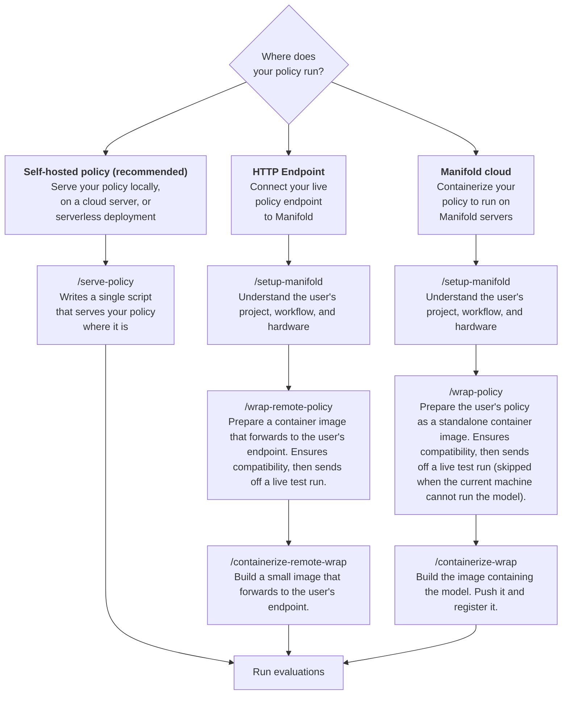

# manifold-skills

AI agent skills for the Manifold platform.

## Installation

Teach Codex, Claude Code, Cursor, and 70+ other AI agents to work with Manifold.

```
npx skills add bifrostai/manifold-skills --all
```

We recommend serving your policy directly on a GPU machine you own. In Claude Code:

```
/serve-policy
```

In Codex:

```
$serve-policy
```

## Workflow

Pick the path that matches where your policy runs. We recommend
self-hosting.



### Self-hosted policy

Run `/serve-policy` inside your policy project. Your agent reads your model
code and asks which benchmark to evaluate on. It writes a short Python
script that serves your policy from your own machine. Then it starts the
script with `manifold policy serve`.

To check the setup, your agent runs the debug version of your benchmark. A
debug benchmark sends the same data as the full benchmark, with fewer tasks
or episodes, so you get a first score quickly.

### HTTP endpoint or Manifold cloud

Run `/setup-manifold`. Your agent asks where your model runs, then continues
with the matching skills.

## Skills

| Skill | When to use it |
|---|---|
| [`serve-policy`](skills/serve-policy/SKILL.md) | Your policy runs locally, on a cloud server, or on a serverless deployment. Your agent writes a script that serves it from there. |
| [`setup-manifold`](skills/setup-manifold/SKILL.md) | Start here for an HTTP endpoint or for Manifold cloud. Your agent asks about your project and picks the next skill. |
| [`wrap-remote-policy`](skills/wrap-remote-policy/SKILL.md) | Your policy runs behind an HTTP endpoint. Your agent writes a Python wrapper that calls your endpoint. Run `setup-manifold` first. |
| [`containerize-remote-wrap`](skills/containerize-remote-wrap/SKILL.md) | Run it after `wrap-remote-policy`. Your agent packages the wrapper as a container image and registers it with Manifold. You need a container registry. |
| [`wrap-policy`](skills/wrap-policy/SKILL.md) | Your policy should run on Manifold's machines. Your agent writes a Python wrapper around your model and tests it. Run `setup-manifold` first. |
| [`containerize-wrap`](skills/containerize-wrap/SKILL.md) | Run it after `wrap-policy`. Your agent builds a container image with your model and registers it with Manifold. You need a container registry. |

## Structure

```
skills/
  <skill-name>/
    SKILL.md        # the skill definition (frontmatter + instructions)
```

Each `SKILL.md` has YAML frontmatter with `name`, `description`, and `compatibility` (prerequisites), followed by the procedural guide.

Skills produce structured **checkpoints** at each phase exit.
