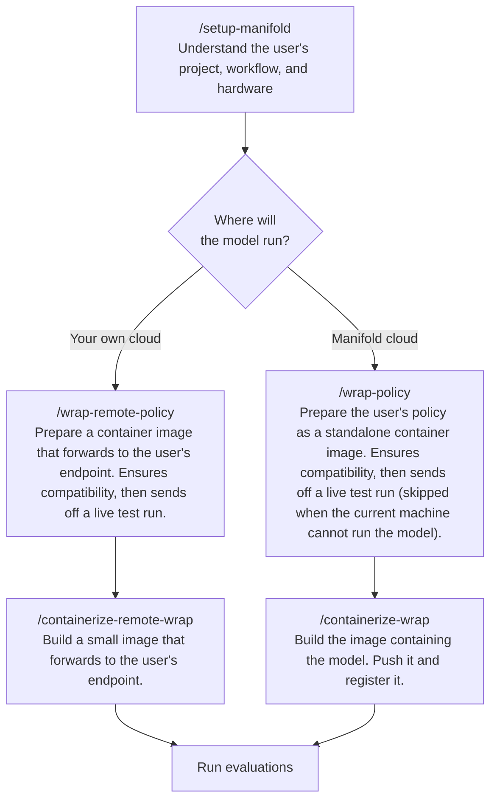

# manifold-skills

AI agent skills for the Manifold platform.

## Installation

Teach Codex, Claude Code, Cursor, and 70+ other AI agents to work with Manifold.

```
npx skills add bifrostai/manifold-skills --all
```

Then start the first skill. In Claude Code:

```
/setup-manifold
```

In Codex:

```
$setup-manifold
```

## Workflow

Run `/setup-manifold` to begin. Your agent may ask you questions about your project.



## Skills

| Skill | What it does |
|---|---|
| [`setup-manifold`](skills/setup-manifold/SKILL.md) | Set up a project for Manifold: gather what the wrap and container steps will need, and write it to `.manifold/CONTEXT.md`. Asks first where the model runs (in the built container, or on the user's own inference server), then branches the follow-up questions and picks the next skill accordingly. Three phases: look at the project, interview, write CONTEXT.md. |
| [`wrap-policy`](skills/wrap-policy/SKILL.md) | Wrap a researcher's policy for Manifold when the model loads into the container: write the driver, profile, and pairing files; pass `check_compatibility` and `verify`; prove it with a live `evaluate` run (skipped, with the user's consent, on a machine that cannot run the model). Three phases: understand, design, implement. |
| [`containerize-wrap`](skills/containerize-wrap/SKILL.md) | Package a verified policy wrap as a container image, push it to a registry, and register it on the platform. Then ask the user whether to submit a scored test run. Four phases: understand, design, build & push, register & offer a test run. |
| [`wrap-remote-policy`](skills/wrap-remote-policy/SKILL.md) | Wrap a researcher's policy for Manifold when the model runs on the user's own inference server (Modal endpoint, private HTTPS box): write a driver to dial the server, plus the profile and pairing files; pass `check_compatibility` and `verify`; prove it with a live run against the endpoint. Three phases: understand, design, implement. Run `setup-manifold` first to write `CONTEXT.md`; this skill reads it. |
| [`containerize-remote-wrap`](skills/containerize-remote-wrap/SKILL.md) | Package a remote-endpoint wrap as a container image, push it to a registry, and register it with the endpoint URL in `config.env` and `minimum_gpu_memory_gb: 0`. Then ask the user whether to submit a scored test run. Four phases: understand, design, build & push, register & offer a test run. |

## Structure

```
skills/
  <skill-name>/
    SKILL.md        # the skill definition (frontmatter + instructions)
```

Each `SKILL.md` has YAML frontmatter with `name`, `description`, and `compatibility` (prerequisites), followed by the procedural guide.

Skills produce structured **checkpoints** at each phase exit.
